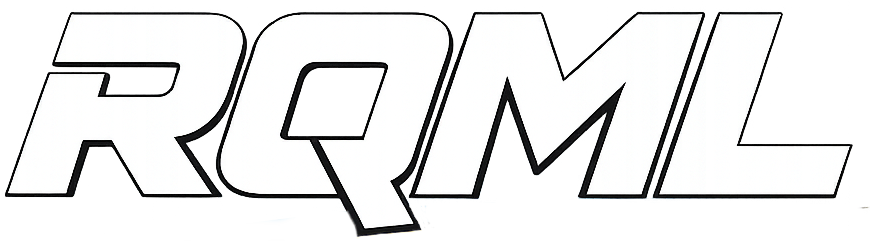
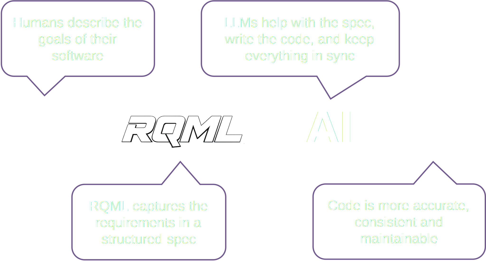
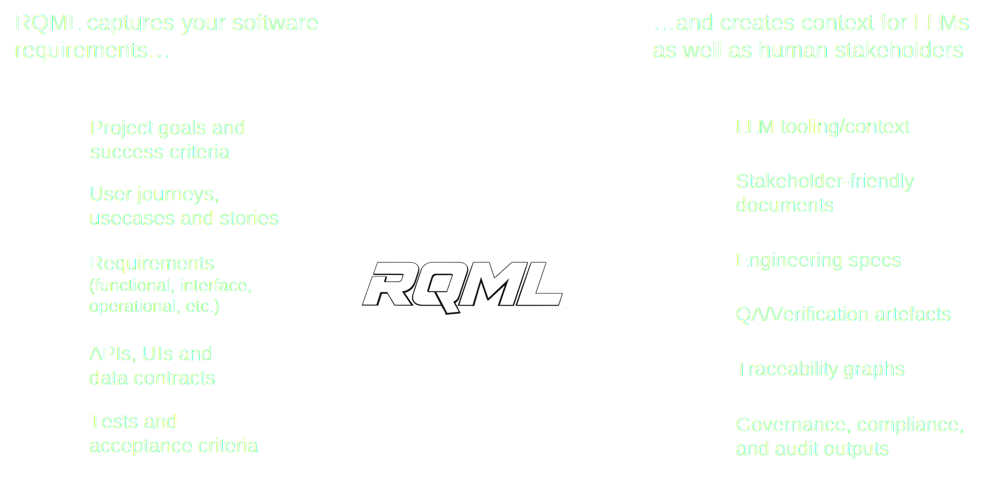

<p align="center">
  
</p>

<h1 align="center">Requirements Markup Language</h1>

<p align="center">
  <strong>An LLM-first (but human readable) software requirements format that captures your intent and turns it into reliable project context.</strong>
</p>

<p align="center">
  <a href="https://rqml.org/docs/quick-start">Quick Start</a> •
  <a href="https://rqml.org/docs/user-guide">User Guide</a> •
  <a href="https://rqml.org/docs/reference">Reference</a> •
  <a href="https://rqml.org/docs/examples">Examples</a>
</p>

<p align="center">
  
  
</p>

---

## The Problem

LLMs amplify weak requirements. Teams cut corners on specs because writing "proper documentation" feels slow and unrewarding. AI is fast—but it **guesses context** unless you provide it. You end up with prompt soup, inconsistent decisions, and fragile architecture.

## The Solution

RQML gives your project a **single source of truth** for system intent—structured enough for tools and LLMs to consume reliably, human-readable enough that your team will actually use it.

<p align="center">
  
</p>

**RQML is the missing piece in your LLM workflow.**

<p align="center">
  
</p>

---

## Quick Start

### 1. Create one `.rqml` file in your project root

By convention, name it `requirements.rqml`—or use a descriptive name like `myapp.rqml`.

```xml
<rqml xmlns="https://rqml.org/schema/2.0.1" version="2.0.1" docId="DOC-HELLO-001" status="draft">
  <meta>
    <title>Hello World CLI</title>
    <system>hello</system>
  </meta>
  <requirements>
    <req id="REQ-HELLO-001" type="FR" title="Print greeting" status="draft" priority="must">
      <statement>
        The program MUST print "Hello, world!" to standard output
        and exit with status code 0.
      </statement>
    </req>
  </requirements>
</rqml>
```

### 2. Add `AGENTS.md` to guide your LLM

Download the [AGENTS.md template](https://rqml.org/AGENTS.md) and add it to your project root. It tells AI coding assistants to follow spec-first development with configurable strictness levels:

| Level | Description |
|-------|-------------|
| `relaxed` | Prototyping. Spec is advisory. Quick iteration allowed. |
| `standard` | Production default. Spec-first for features. Core traces. |
| `strict` | Full traceability. All behavior specified. No ghost features. |
| `certified` | Regulated/safety-critical. Audit-grade traces with metadata. |

### 3. Use it everywhere

- **LLM prompts**: "Implement the requirements in the .rqml file"
- **Code generation**: Requirements become the authoritative source
- **Tests**: Trace test cases back to requirements
- **Reviews**: PRs show exactly what requirements changed and why

**Start minimal. Grow as the system grows. Let the structure do the hard work.**

---

## What RQML Captures

| Section | Purpose |
|---------|---------|
| **Goals** | Business objectives, quality targets, obstacles |
| **Scenarios** | User stories, use cases, acceptance flows |
| **Requirements** | Functional and non-functional requirements |
| **Interfaces** | APIs, data contracts, system boundaries |
| **Behavior** | State machines, workflows, decision logic |
| **Verification** | Test cases, acceptance criteria |
| **Trace** | Links between goals → requirements → tests |

---

## Why RQML?

- **Clear structure** — Goals, scenarios, requirements, verification, traceability—organized so nothing important gets lost
- **Low ceremony** — Enough discipline to be useful, without turning spec writing into a second job
- **LLM-ready** — Predictable, structured context that improves codegen, refactors, tests, and architecture decisions
- **Diff-friendly** — Review requirements like code. PRs show exactly what changed and why
- **Traceable** — Connect goals → requirements → verification so you can prove what you built matches intent
- **Toolable** — Schema validation, editor support, CI checks, and automated consistency improvements

---

## Documentation

📖 **[rqml.org](https://rqml.org)** — Full documentation

- [Quick Start](https://rqml.org/docs/quick-start) — Get up and running
- [User Guide](https://rqml.org/docs/user-guide) — Learn the concepts
- [Reference](https://rqml.org/docs/reference) — Element and attribute index
- [Examples](https://rqml.org/docs/examples) — Real-world RQML documents

---

## Repository Structure

```
rqml/
├── schema/     # XSD schema, examples, AGENTS.md template
├── docs/       # Documentation site (rqml.org)
└── rfc/        # Design proposals and decisions
```

---

## Contributing

We welcome contributions! See [CONTRIBUTING.md](CONTRIBUTING.md) for guidelines.

- **Report issues** — Found a bug or have a suggestion? [Open an issue](https://github.com/rqml-org/rqml/issues)
- **Propose changes** — Submit RFCs in the `rfc/` directory for significant changes
- **Improve docs** — Documentation improvements are always welcome

---

## License

RQML is licensed under the [Apache License 2.0](LICENSE).

---

<p align="center">
  <strong>Put your intent in the repo. Make LLM output calmer, cleaner, and easier to trust.</strong>
</p>

<p align="center">
  <a href="https://rqml.org/docs/quick-start">
    
  </a>
</p>
